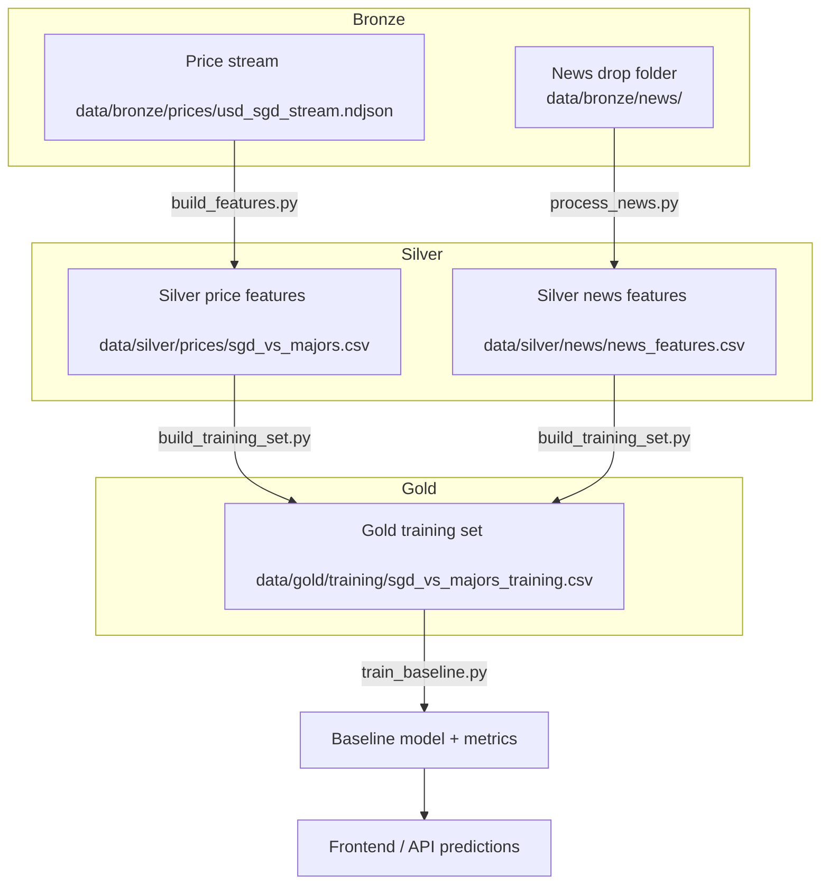

# OANDA SGD FX ML Pipeline

This project implements a medallion-style workflow for modelling Singapore dollar FX moves with data pulled from OANDA v20. The Bronze layer captures raw price ticks, candles, and curated news drops; the Silver layer engineers aligned features; the Gold layer consolidates everything into trainable datasets and models.

## Project Layout

```
oanda-fx-ml/
├── .env.example
├── configs/
│   ├── features.yaml
│   └── pairs.yaml
├── data/
│   ├── bronze/
│   │   ├── news/          # Live drop folder watched by process_news.py
│   │   ├── news_corpus/   # Synthetic corpus replayed by simulate_news_feed.py
│   │   ├── orderbook/
│   │   └── prices/
│   ├── silver/
│   │   ├── news/
│   │   └── prices/
│   └── gold/
│       ├── models/
│       └── training/
├── src/
│   ├── build_features.py
│   ├── build_training_set.py
│   ├── fetch_candles.py
│   ├── fetch_orderbook.py
│   ├── oanda_api.py
│   ├── process_news.py
│   ├── stream_prices.py
│   └── train_baseline.py
└── tests/
    └── __init__.py
```

## Getting Started

## Pipeline Overview
## Pipeline Walkthrough

1. **Capture (Bronze)** – `stream_prices.py` archives tick-level quotes while historical utilities (`fetch_candles.py`, `fetch_orderbook.py`) backfill market context. Curated or simulated headlines land in `data/bronze/news/`.
2. **Feature Engineering (Silver)** – `build_features.py` aggregates ticks into rolling statistics per instrument, and `process_news.py` transforms raw text into sentiment/topic signals. Both scripts append new rows incrementally so the layer can refresh while the stream is running.
3. **Contextual Join (Gold)** – `build_training_set.py` performs an as-of merge that fuses the latest Silver price slice with the most recent news affecting each pair, producing a model-ready table.
4. **Model & Evaluation** – `train_baseline.py` standardises features, fits logistic regression, and emits both a JSON metrics summary and a persisted `(model, scaler, feature list)` bundle for downstream APIs/UI.
5. **Replay & Simulation** – `simulate_news_feed.py` drips stories into the Bronze folder on a timer, re-running Silver ingestion and (optionally) Gold/model refresh so you can observe real-time impact without waiting for live headlines.

### Script ↔ Artifact Map

| Script | Input artefacts | Output artefacts | Layer |
| --- | --- | --- | --- |
| `stream_prices.py` | OANDA pricing stream | `data/bronze/prices/usd_sgd_stream.ndjson` | Bronze |
| `fetch_candles.py` | OANDA candles endpoint | `data/bronze/prices/*_m1.json` | Bronze |
| `fetch_orderbook.py` | OANDA order-book endpoint | `data/bronze/orderbook/*.json` | Bronze |
| `process_news.py` | `data/bronze/news/` files | `data/silver/news/news_features.csv` | Silver |
| `build_features.py` | Bronze tick NDJSON | `data/silver/prices/sgd_vs_majors.csv` | Silver |
| `build_training_set.py` | Silver price + news | `data/gold/training/sgd_vs_majors_training.csv` | Gold |
| `train_baseline.py` | Gold training set | JSON metrics + `data/gold/models/*.pkl` | Gold |
| `simulate_news_feed.py` | `data/bronze/news_corpus/` + existing layers | Replays Bronze news + optional refreshed Silver/Gold/Model | Cross-layer |

### Feature Families

- **Market microstructure** – spreads, level-one liquidity, intraday ranges capture immediate supply/demand.
- **Momentum & trend** – `ret_1`, `ret_5`, moving averages, EWMA, and momentum indicators flag directionality across short horizons.
- **Volatility & risk** – rolling standard deviation (`roll_vol_20`) and volatility flags in text highlight turbulent conditions.
- **Sentiment & narrative** – sentiment score, subjectivity, volatility keywords, and macro-related scores summarise tone; named entities surface who/what is driving the story.
- **Temporal alignment** – publish hour and time-to-close features allow the model to react differently to pre-market vs. post-close headlines.




1. **Install dependencies**
   ```bash
   python -m venv .venv
   source .venv/bin/activate
   pip install -e .
   ```

2. **Configure credentials**
   ```bash
   cp .env.example .env
   # Fill in OANDA_TOKEN, OANDA_ACCOUNT_ID, and OANDA_ENV (practice/live)
   export $(grep -v '^#' .env | xargs)
   ```

3. **Bronze layer – capture raw data**
   ```bash
   # Stream live prices and archive raw ticks
   python src/stream_prices.py USD_SGD EUR_USD GBP_USD \
     --bronze-path data/bronze/prices/usd_sgd_stream.ndjson \
     --max-ticks 200 --log-every 25

   # Fetch historical candles
   python src/fetch_candles.py USD_SGD --granularity M1 --count 2000 \
     --output data/bronze/prices/usdsgd_m1.json
   python src/fetch_candles.py EUR_USD --granularity M1 --count 2000 \
     --output data/bronze/prices/eurusd_m1.json

   # Snapshot supported order books (majors only)
   python src/fetch_orderbook.py EUR_USD \
     --output data/bronze/orderbook/eurusd_orderbook.json
   ```
   Drop curated news stories (text or JSON) into `data/bronze/news/`. They are treated as the raw Bronze feed for macro/LLM features.

4. **Silver layer – engineer features**
   ```bash
   # Promote price ticks to engineered features
   python src/build_features.py \
     --input data/bronze/prices/usd_sgd_stream.ndjson \
     --output data/silver/prices/sgd_vs_majors.csv \
     --flush-interval 50 --log-every 50

   # Convert curated news into numeric sentiment features
   python src/process_news.py \
     --input-dir data/bronze/news \
     --silver-path data/silver/news/news_features.csv
   ```
   `process_news.py --follow` can run as a lightweight watcher that ingests new files as they arrive.

5. **Gold layer – align price and news signals**
   ```bash
   python src/build_training_set.py \
     --price-features data/silver/prices/sgd_vs_majors.csv \
     --news-features data/silver/news/news_features.csv \
     --output data/gold/training/sgd_vs_majors_training.csv
   ```
   The script performs an as-of join so that each price observation carries the latest relevant news context within a configurable lookback window (default 6h).

6. **Train the predictive baseline**
   ```bash
   python src/train_baseline.py \
     data/gold/training/sgd_vs_majors_training.csv \
     --model-output data/gold/models/logreg_baseline.pkl
   ```
   The command prints a classification report and stores the fitted scaler + model bundle for downstream use.

## Simulating News-driven Predictions

1. Start the price stream and feature builder in separate terminals so the Silver price table refreshes continuously.
   ```bash
   python src/stream_prices.py USD_SGD EUR_USD GBP_USD \
     --bronze-path data/bronze/prices/usd_sgd_stream.ndjson \
     --log-every 25 --include-heartbeats
   python src/build_features.py \
     --input data/bronze/prices/usd_sgd_stream.ndjson \
     --output data/silver/prices/sgd_vs_majors.csv \
     --flush-interval 50 --log-every 50
   ```
2. Ingest news in real time by dripping the corpus into the live folder. The helper copies each story, re-runs `process_news.py`, and (optionally) rebuilds Gold + refreshes the baseline model so your UI can pull the latest signal.
   ```bash
   python src/simulate_news_feed.py \
     --corpus data/bronze/news_corpus \
     --target data/bronze/news \
     --silver-path data/silver/news/news_features.csv \
     --rebuild-gold --retrain --interval 20 --jitter 15 \
     --model-output data/gold/models/logreg_live.pkl
   ```
   The command emits timestamps when each headline lands, runs the ingestion scripts, and sleeps between drops to mimic irregular arrival times.
3. Attach your front-end or monitoring job to `data/gold/models/logreg_live.pkl` (model + scaler bundle) and/or the JSON output of `train_baseline.py` to display the latest direction probabilities as news arrives.

## News Ingestion Notes

- `src/process_news.py` supports plain-text or JSON files. JSON documents can expose keys such as `headline`, `body`, `published_at`, and `source`; missing metadata falls back to file timestamps.
- Feature extraction currently uses a lightweight lexicon for sentiment and tags Singapore-related terms. Replace the heuristics or extend the script to call your preferred LLM service when you are ready for richer embeddings.
- Processed rows append to `data/silver/news/news_features.csv` and are tracked via `data/bronze/news/.processed.json` to prevent duplicate ingestion.

## Code Annotations

- Every module under `src/` now carries detailed module- and function-level docstrings that explain the role of each component in the medallion architecture.
- Inline comments call out non-obvious implementation choices (e.g. incremental flush thresholds, sparse-aware scaling) so future contributors can reason about the design quickly.

## Feature Reference

## Layer Schema Examples

### Bronze Layer

**Text Table**

| Column | Example | Notes |
| --- | --- | --- |
| url | https://reuters.com/xyz | Source of article |
| title | "Fed hikes interest rate" | Scraped title |
| publish_date | 9/23/2025 14:22 | Use original time if available |

**Stock Price Table**

| Column | Example | Notes |
| --- | --- | --- |
| Open | 4410.1 | From yfinance |
| High | 4420.5 |  |
| Low | 4400.3 |  |
| Close | 4412.3 |  |
| Volume | 2.3B |  |
| Date (index) | 9/23/2025 | Aligned with news date |

### Silver Layer

- Scrape the URL to extract full article text (`text`) and generate an NLP summary (`summary`).
- Clean Bronze inputs by handling missing values, imputing gaps, enforcing types, and dropping placeholder values before promotion to Silver.

### Gold Layer

**Text-driven Features**

| Category | Feature | Type | Description |
| --- | --- | --- | --- |
| Sentiment & Tone | sentiment_score | Float (-1 to 1) | Overall tone (negative/neutral/positive) |
| Sentiment & Tone | subjectivity | Float (0–1) | Objective vs opinionated tone |
| Sentiment & Tone | volatility_flag | Bool | Mentions words like "crash", "plunge", "surge" |
| Topic Signals | named_entities | str | Entities mentioned (e.g., "Powell", "Apple") |
| Topic Signals | is_macro_related | Float (0–10) | Intensity of macroeconomic terminology |
| Temporal Context | publish_hour | Int (0–23) | Hour the news was published |
| Temporal Context | time_to_close | Float (hrs) | Hours between publish time and market close |

**Price-derived Features**

| Feature | Type | Description |
| --- | --- | --- |
| Close(t-1) | Float | Previous close price |
| Volume(t-1) | Float | Previous volume |
| High(t-1) - Low(t-1) | Float | Intraday range |
| Close(t-1) - Open(t-1) | Float | Intraday momentum |
| Moving averages | Float | Rolling window means (configurable horizon) |
| EWMA | Float | Exponentially weighted moving average |
| Momentum indicators | Float | Additional technical factors (e.g., RSI, MACD) |

- **Bronze layer artefacts**
  - `data/bronze/prices/usd_sgd_stream.ndjson` logs every tick with the full bid/ask ladder, closeout quotes, tradeable flags, and instrument metadata. Candle dumps such as `usdsgd_m1.json`/`eurusd_m1.json` follow the `InstrumentsCandles` schema (`candles[].mid/bid/ask`, `volume`, `time`, `complete`), while order-book captures (e.g. `eurusd_orderbook.json`) preserve depth snapshots. The curated corpus in `data/bronze/news_corpus/` (five synthetic SGD-relevant stories) seeds the sentiment pipeline and can be replayed into `data/bronze/news/` via `simulate_news_feed.py`.
- **Silver price features** (`data/silver/prices/sgd_vs_majors.csv`) contain `time`, `instrument`, `mid`, `spread`, `ret_1`, `ret_5`, `roll_vol_20`, `zscore_20`, `bid_liquidity`, `ask_liquidity`, and the binary label `y`. Rows are flushed incrementally as the streaming buffer reaches the configured window length.
- **Silver news features** (`data/silver/news/news_features.csv`) record `story_id`, `headline`, `published_at`, `source`, lexical counts (`word_count`, `unique_word_count`, `positive_hits`, `negative_hits`), the normalised `sentiment_score`, SGD-specific flags (`mentions_sgd`, `mas_mentions`), and `currency_mentions`.
- **Gold training table** (`data/gold/training/sgd_vs_majors_training.csv`) preserves all Silver price fields and appends contextual columns: `news_sentiment_score`, `news_mentions_sgd`, `news_word_count`, `news_age_minutes`, `news_story_id`, `news_headline`, `news_source`, and the aligned `published_at`. When no qualifying headline is found, neutral defaults (0 sentiment / counts, NULL identifiers) are injected so the design matrix remains dense.

## Glossary

- **Medallion architecture**: A layered design pattern (Bronze → Silver → Gold) for progressively refining data from raw ingestion to analytics-ready tables.
- **EWMA**: Exponentially Weighted Moving Average; emphasises recent observations when smoothing data.
- **RSI / MACD**: Popular momentum indicators used to gauge overbought/oversold conditions and trend strength.
- **Probability of direction**: The logistic regression output signalling how likely the model thinks the price will rise (1) versus fall (0).
- **Bronze / Silver / Gold layers**: Names for the raw (Bronze), cleaned feature (Silver), and model-ready (Gold) tables in the data engineering pipeline.
- **Candle**: A summary of price movement over a time window (open, high, low, close).
- **Order book**: Snapshot of pending buy/sell orders showing available volume at each price level.
- **Sentiment score**: Simple numeric gauge of how positive or negative a news story sounds.
- **Tick**: One update from the live price stream (bid/ask quotes plus metadata).
- **USD/SGD, EUR/USD, GBP/USD**: Currency pairs; the value of one unit of the first currency expressed in the second.
- **Logistic regression**: A statistical model that outputs the probability of a binary outcome (e.g., price up vs. down).
- **As-of join**: A merge that pairs each row with the most recent matching observation before it in time.
- **Heartbeat**: Keep-alive message from the streaming API indicating the connection is still active even if no prices changed.

## Operational Notes

- OANDA streams are 24×5: markets close Friday 5 pm New York time and reopen Sunday 5 pm New York (≈21:00–22:00 UTC depending on DST). During closure the API returns the last snapshot with `tradeable=false`; the streamer will stay connected but no new ticks arrive.
- Use `--max-ticks` on `stream_prices.py` if you want an automatic stop after N price messages; otherwise leave it running and watch the `--log-every` output for progress once markets reopen.
- If the Silver price file is empty, make sure the stream has produced at least `--min-rows` ticks before running `build_features.py`; the script logs how many rows were written each flush.
- For offline experiments or market downtime, bootstrap your datasets with `fetch_candles.py` and `fetch_orderbook.py` to generate Bronze artefacts before moving to Silver/Gold.

## Data Cleaning & Feature Engineering Flow

- `stream_prices.py` validates credentials, can archive every message to Bronze, and streams progress/heartbeat counts to stderr for long-running capture jobs.
- `build_features.py` strips invalid JSON lines, coerces timestamps to UTC, sorts ticks per instrument, and engineers mid-price statistics (returns, spreads, rolling volatility, z-scores) plus level-one liquidity. Rows lacking sufficient history are dropped; only new slices are appended to Silver to avoid rewriting large files.
- `process_news.py` normalises text/JSON structures, falls back to file mtimes when publication metadata is missing, tokenises content for lexicon counts, and leverages a manifest to prevent reprocessing.
- `build_training_set.py` parses the optional `currency_mentions`, filters news by instrument legs (and SGD by default), then executes an as-of merge within a configurable tolerance. Missing matches are filled with neutral values while retaining timing metadata for downstream joins.
- `train_baseline.py` removes non-modelling columns, one-hot encodes categoricals, fills NA with zeros, applies a sparse-friendly scaler, trains logistic regression, and persists the `(model, scaler, feature list)` bundle alongside JSON diagnostics.

## Extending the Pipeline

- Adjust `configs/pairs.yaml` to switch instrument baskets, and `configs/features.yaml` to document newly engineered factors.
- Update `build_training_set.py --news-tolerance` to widen or narrow the lookback window for associating news with ticks.
- Swap `train_baseline.py` for more advanced models (gradient boosting, sequence models) once the Gold dataset is stable. The script saves the StandardScaler alongside the classifier to ease deployment.

## OANDA API References

- Streaming: `PricingStream` (max 4 price updates/sec per instrument). Heartbeats can be persisted via `--include-heartbeats` on `stream_prices.py`.
- Historical data: `InstrumentsCandles` with configurable price components (`--price` accepts combinations such as `M`, `B`, `A`).
- Order book snapshots: `InstrumentsOrderBook` is available for major pairs (e.g. `EUR_USD`, `GBP_USD`, `USD_JPY`).

With these building blocks you can automate Bronze capture, incrementally refresh Silver features, and keep the Gold training table up to date for SGD-centric FX modelling.
